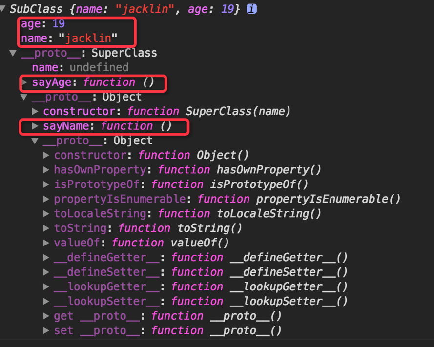
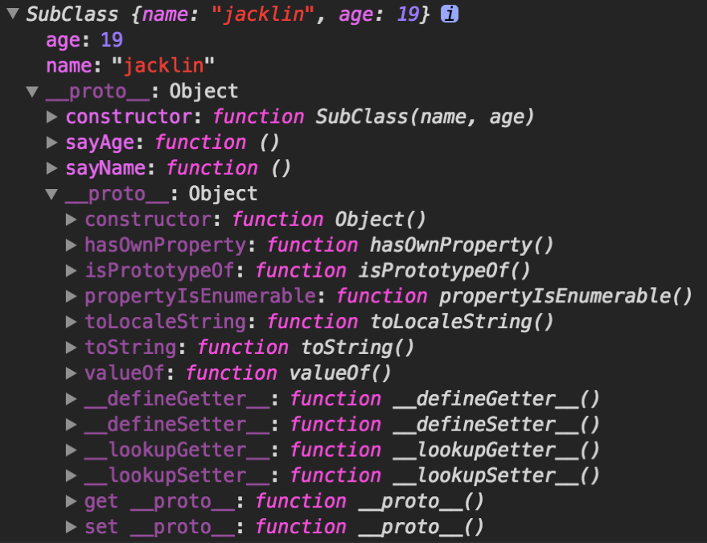

# jsadvanced

The jsadvanced containing some tips, conclusions, best practices for your day to day workflow.
of course, we cannot miss graph and demos to demonstrate!

## Table of Contents

- [Process control statements-loop](#Process control statements-loop)
- [Es6 Generator](#Es6 Generator)
- [Several Solutions To Create Object](#Several Solutions To Create Object)
- [var, let and const](#var, let and const)

## Process control statements-loop

how to use loop statement more efficiently.

## Es6 Generator

```javascript

```
es6 generator

## Several Solutions To Create Object

组合继承模式
```javascript
    function SuperClass(name){
        this.name = name;
    }
    SuperClass.prototype = {
        constructor: SuperClass,
        sayName: function(){
            console.log(this.name);
        }
    };
    function SubClass(name, age){
        //借用父类构造函数
        SuperClass.call(this, name);
        this.age = age;
    }
    SubClass.prototype = {
        constructor: SubClass,

    };
    SubClass.prototype.sayAge = function(){
        console.log(this.age);
    };
    var SubObj = new SubClass("jacklin", 19);
```


寄生组合继承模式
```javascript
    function SuperClass(name){
        this.name = name;
    }
    SuperClass.prototype = {
        constructor: SuperClass,
        sayName: function(){
            console.log(this.name);
        }
    };
    function SubClass(name, age){
        //借用父类构造函数
        SuperClass.call(this, name);
        this.age = age;
    }

    SubClass.prototype = Object.assign({}, SuperClass.prototype);
    SubClass.prototype.constructor = SubClass;

    SubClass.prototype.sayAge = function(){
        console.log(this.age);
    };
    var SubObj = new SubClass("jacklin", 19);
    console.log(SubObj);
```

## var, let and const


## 深度赋值对象
