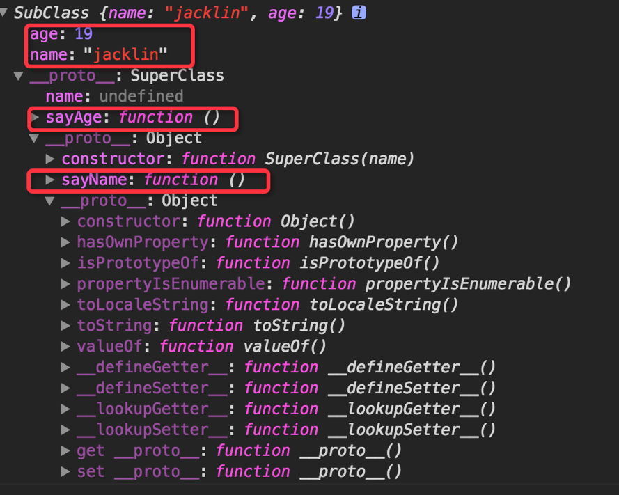
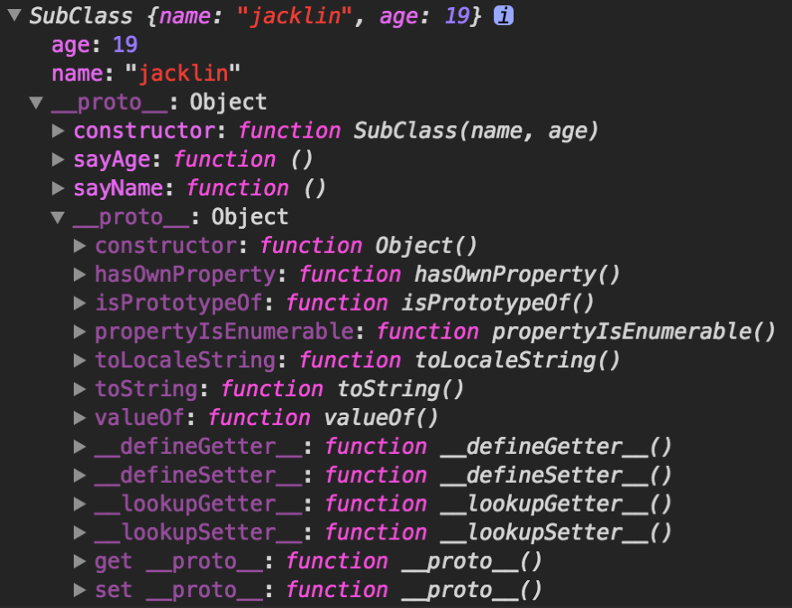
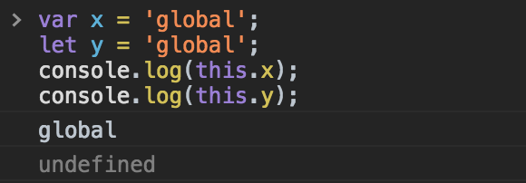
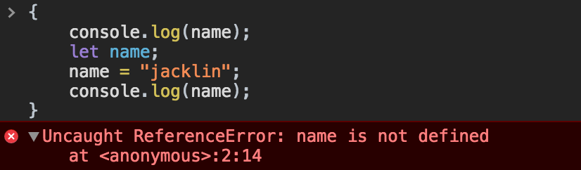
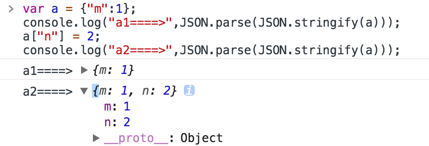

# jsadvanced

The jsadvanced containing some tips, conclusions, best practices for your day to day workflow.
of course, we cannot miss graph and demos to demonstrate!

## Table of Contents

- [Process control statements loop](#process-control-statements-loop)
- [Es6 Generator](#es6-generator)
- [Prototype Inherit and class](#prototype-inherit)
- [Variables Declaration](#variables-declaration)
- [Value Types and Reference Types](#value-reference-type)
- [Modules](#modules)
- [Destructuring](#destructuring)
- [Function](#function)
- [This](#this)
- [Symbols](#symbols)
- [Proxy and Reflect](#proxy-and-reflect)
- [Decorator](#decorator)

## Process control statements loop

how to use loop statement more efficiently.

## Es6 Generator

```javascript

```

## Prototype Inherit and class

1.combination inheritance(compose constructor stealing and prototype chain)
```javascript
    function SuperClass(name){
        this.name = name;
    }
    SuperClass.prototype = {
        constructor: SuperClass,
        sayName: function(){
            console.log(this.name);
        }
    };
    function SubClass(name, age){
        //constructor stealing
        SuperClass.call(this, name);
        this.age = age;
    }
    SubClass.prototype = new SuperClass();
    SubClass.prototype.sayAge = function(){
        console.log(this.age);
    };
    var SubObj = new SubClass("jacklin", 19);
```


2.寄生组合继承模式
```javascript
    function SuperClass(name){
        this.name = name;
    }
    SuperClass.prototype = {
        constructor: SuperClass,
        sayName: function(){
            console.log(this.name);
        }
    };
    function SubClass(name, age){
        //constructor stealing, inherit instance property of SuperClass
        SuperClass.call(this, name);
        this.age = age;
    }
    //inherit prototype property of SuperClass
    SubClass.prototype = Object.assign({}, SuperClass.prototype);
    SubClass.prototype.constructor = SubClass;

    SubClass.prototype.sayAge = function(){
        console.log(this.age);
    };
    var SubObj = new SubClass("jacklin", 19);
    console.log(SubObj);
```


3. es6 class

    a very good document: https://developer.mozilla.org/en-US/docs/Web/JavaScript/Reference/Classes
    
```javascript
    
```

## Variables Declaration
* var
* let
* const

var变量声明无论出现在代码的任何位置，都会在任何代码执行之前处理(var hoisting)。使用var语句声明的变量的*作用域*是*当前执行位置的上下文*：
一个函数的内部（声明在函数内）或者全局（声明在函数外）。

> **Best Practice**: 最好在作用域的最开始（函数或者全局代码的开头）声明变量。这样可以使变量的作用域变得清晰。

let允许你声明一个作用域被限制在块级中的变量、语句或者表达式。而var关键字声明的变量只能作用于全局或者整个函数块内。

在程序或者函数的顶层，let并不会像var一样在全局对象上创造一个属性，比如：


let 将会提升这个变量到语句块的顶部。然而，在这个语句块中，在变量声明之前引用这个变量会导致一个 ReferenceError的结果,
因为let变量 在"暂存死区" (从块的开始到声明这段).



const声明并初始化一个只读的常量。常量拥有块作用域。常量的值不能通过再赋值改变，也不能再次声明。
这不意味着常量指向的值不可变，而是变量标识符的值只能赋值一次。
```javascript
    // 常量可以定义成对象
    const myObj = {"key": "value"};
    // 重写对象一样会失败
    myObj = {"OTHER_KEY": "value"};
    // 常量对象的属性是可以重写的
    myObj.key = "otherValue";
```


## Value Types and Reference Types

 引用类型使用的时候需要特别注意，如果一个全局引用类型在多个功能函数或者模块中使用, 特别需要注意当给全局引用类型复制给新参的时候，在功能函数或者模块内部修改形参（写操作）。
    
* 值类型
 ```javascript
      var a = 1;
      var b = a;
      console.log("b====>", b)// 1
 ```
* 引用类型

1. console打印引用类型

 ```javascript
      var a = {name: "jack"};
      console.log("a========>",a);
      // {name: "mike"}
      var b = a;
      b.name = "mike";
      console.log("b====>", b);
      // {name: "mike"}
 ```

2. 引用类型作为实参传给功能函数（模块）,注意引用类型的写操作；

 ```javascript
    var person = {name: "jack", age: 19};
    
    function updateName(person,name) {
        person.name = name;
    }
    
    function updateAge(person,age) {
        person.age = age;
    }
    
    updateName(person, "mike");
    
 ```

3. 使用JSON.parse(JSON.stringify(a))来实现引用类型的深度复制



## Modules

<a name="modules--use-them"></a><a name="10.1"></a>
  - [10.1](#modules--use-them) Always use modules (`import`/`export`) over a non-standard module system. You can always transpile to your preferred module system.

    > Why? Modules are the future, let's start using the future now.

    ```javascript
    // bad
    const AirbnbStyleGuide = require('./AirbnbStyleGuide');
    module.exports = AirbnbStyleGuide.es6;

    // ok
    import AirbnbStyleGuide from './AirbnbStyleGuide';
    export default AirbnbStyleGuide.es6;

    // best
    import { es6 } from './AirbnbStyleGuide';
    export default es6;
    ```

  <a name="modules--no-wildcard"></a><a name="10.2"></a>
  - [10.2](#modules--no-wildcard) Do not use wildcard imports.

    > Why? This makes sure you have a single default export.

    ```javascript
    // bad
    import * as AirbnbStyleGuide from './AirbnbStyleGuide';

    // good
    import AirbnbStyleGuide from './AirbnbStyleGuide';
    ```

  <a name="modules--no-export-from-import"></a><a name="10.3"></a>
  - [10.3](#modules--no-export-from-import) And do not export directly from an import.

    > Why? Although the one-liner is concise, having one clear way to import and one clear way to export makes things consistent.

    ```javascript
    // bad
    // filename es6.js
    export { es6 as default } from './AirbnbStyleGuide';

    // good
    // filename es6.js
    import { es6 } from './AirbnbStyleGuide';
    export default es6;
    ```

  <a name="modules--no-duplicate-imports"></a>
  - [10.4](#modules--no-duplicate-imports) Only import from a path in one place.
 eslint: [`no-duplicate-imports`](http://eslint.org/docs/rules/no-duplicate-imports)
    > Why? Having multiple lines that import from the same path can make code harder to maintain.

    ```javascript
    // bad
    import foo from 'foo';
    // … some other imports … //
    import { named1, named2 } from 'foo';

    // good
    import foo, { named1, named2 } from 'foo';

    // good
    import foo, {
      named1,
      named2,
    } from 'foo';
    ```

  <a name="modules--no-mutable-exports"></a>
  - [10.5](#modules--no-mutable-exports) Do not export mutable bindings.
 eslint: [`import/no-mutable-exports`](https://github.com/benmosher/eslint-plugin-import/blob/master/docs/rules/no-mutable-exports.md)
    > Why? Mutation should be avoided in general, but in particular when exporting mutable bindings. While this technique may be needed for some special cases, in general, only constant references should be exported.

    ```javascript
    // bad
    let foo = 3;
    export { foo };

    // good
    const foo = 3;
    export { foo };
    ```

  <a name="modules--prefer-default-export"></a>
  - [10.6](#modules--prefer-default-export) In modules with a single export, prefer default export over named export.
 eslint: [`import/prefer-default-export`](https://github.com/benmosher/eslint-plugin-import/blob/master/docs/rules/prefer-default-export.md)

    ```javascript
    // bad
    export function foo() {}

    // good
    export default function foo() {}
    ```

  <a name="modules--imports-first"></a>
  - [10.7](#modules--imports-first) Put all `import`s above non-import statements.
 eslint: [`import/first`](https://github.com/benmosher/eslint-plugin-import/blob/master/docs/rules/first.md)
    > Why? Since `import`s are hoisted, keeping them all at the top prevents surprising behavior.

    ```javascript
    // bad
    import foo from 'foo';
    foo.init();

    import bar from 'bar';

    // good
    import foo from 'foo';
    import bar from 'bar';

    foo.init();
    ```

  <a name="modules--multiline-imports-over-newlines"></a>
  - [10.8](#modules--multiline-imports-over-newlines) Multiline imports should be indented just like multiline array and object literals.

    > Why? The curly braces follow the same indentation rules as every other curly brace block in the style guide, as do the trailing commas.

    ```javascript
    // bad
    import {longNameA, longNameB, longNameC, longNameD, longNameE} from 'path';

    // good
    import {
      longNameA,
      longNameB,
      longNameC,
      longNameD,
      longNameE,
    } from 'path';
    ```

  <a name="modules--no-webpack-loader-syntax"></a>
  - [10.9](#modules--no-webpack-loader-syntax) Disallow Webpack loader syntax in module import statements.
 eslint: [`import/no-webpack-loader-syntax`](https://github.com/benmosher/eslint-plugin-import/blob/master/docs/rules/no-webpack-loader-syntax.md)
    > Why? Since using Webpack syntax in the imports couples the code to a module bundler. Prefer using the loader syntax in `webpack.config.js`.

    ```javascript
    // bad
    import fooSass from 'css!sass!foo.scss';
    import barCss from 'style!css!bar.css';

    // good
    import fooSass from 'foo.scss';
    import barCss from 'bar.css';
    ```

**[⬆ back to top](#table-of-contents)**


## Destructuring
* object destructuring
> **Best Practice**: Use object destructuring for multiple return values, not array destructuring;
    Destructuring saves you from creating temporary references for those properties.

```javascript
    var user = {
            firstName: "lin",
            lastName: "chengyong"
    }
    // bad
    function getFullName(user) {
      const firstName = user.firstName;
      const lastName = user.lastName;
      ...
      return [firstName, lastName];
    }
    //the caller needs to know the order of return data
    var [firstName, lastName] = getFullName(user);

    // good
    function getFullName(user) {
      const { firstName, lastName } = user;
      ...
      return {firstName, lastName};
    }

    // best
    function getFullName({ firstName, lastName }) {
      ...
      return {firstName, lastName};
    }
    // the caller selects only the data they need
    var {firstName, lastName} = getFullName(user);

```
* array destructuring

```javascript
    const arr = [1, 2, 3, 4];

    // bad
    const first = arr[0];
    const second = arr[1];

    // good
    const [first, second] = arr;
```
* the scene of destructuring

1.函数参数的定义, 对于设计良好的api,通常为函数设计一个对象作为函数的参数，这样可以避免开发者需要记住多个参数的使用顺序。
    同时，使用解构可以避免为这些参数属性创建临时的引用。
```javascript
    function Caller({url, name, ...}){
        // we can use url, name and all the property of parameter object directly.
    }
```
2.给需要解构的的对象属性赋予默认值。
```javascript
    function Caller({
        async = true,
        cache = true,
        beforeSend = noop,
        global = true,
        // more config
        ...
    }){
        // we can use url, name and all the property of parameter object directly.
    };
```
3.使用解构导入部分CommonJS模块
    当我们导入CommonJS模块的时候，很可能在模块中存在很多用不上的方法，通过解构可以很方便的定义模块的一部分方法拆分使用
    这样可以避免命名空间的污染。
```javascript
    const {PropertyA, PropertyB} = require("CommonJs module");
```

## Function
在JavaScript中，函数是第一等对象，不仅因为它既可以像普通对象一样拥有属性和方法，而且重要的是它可以被调用。简单来说它们是Function对象。
函数不同于过程。函数总是会返回一个值，但是一个过程有可能返回一个值，也有可能不返回,如果一个函数中没有使用return语句，则它默认返回undefined。
>**Note**:在函数执行时，this 关键字并不会指向正在运行的函数本身，而是指向调用该函数的对象。
* Use named function expressions instead of function declarations.
Function declarations are hoisted, which means that it’s easy - too easy - to reference the function before it is defined in the file.
This harms readability and maintainability.anonymous functions can make it harder to locate the problem in an Error's call stack.
```javascript
    // bad
    function foo() {
      // ...
    }

    // bad
    const foo = function () {
      // ...
    };

    // good
    const foo = function bar() {
      // ...
    };
```
* Always put default parameters last.
```javascript
    // bad
    function handler(opts = {}, name) {
      // ...
    }

    // good
    function handler(name, opts = {}) {
      // ...
    }
```
* Never mutate parameters.
```javascript
    // bad
    function f1(obj) {
      obj.key = 1;
    }

    // good
    function f2(obj) {
      const key = Object.prototype.hasOwnProperty.call(obj, 'key') ? obj.key : 1;
    }
```
* Arrow Function


* getter
 get 语法将一个对象属性绑定到查询该属性时将被调用的一个函数上。

* setter


## This
函数的调用方式决定了this的值。this不能在执行期间被赋值，在每次函数被调用时this的值也可能会不同。
ES5引入了bind方法来设置函数的this值，而不用考虑函数如何被调用的。

* 在全局作上下文中运行（任何函数外部),this指代全局对象。
```javascript
    function sum(num1, num2){
    	return num1+num2;
    }
    sum(2,3);//5
    this.sum(2,1);//3
    window.sum(2,1);//3
```
* 函数上下文
>**Note**:在函数内部，this的值取决于**函数是如何调用的**。

在严格模式下执行，并且this的值不会在函数执行时被设置，此时的this的值会默认设置为全局对象。
```javascript
    function f1(){
      return this;
    }
    f1() === window; // true
```
在严格模式下，如果this未被执行的上下文环境定义，那么它将会默认为undefined。
```javascript
    function f2(){
      "use strict"; // 这里是严格模式
      return this;
    }
    f2() === undefined; // true
```

1. 以对象方法调用.
>**Note**: 当以对象里的方法的方式调用函数时，它们的 this 是调用该函数的对象.
```javascript
    var obj = {
    	prop: "jack",
    	fa: function(){
    		console.log(this.prop)
    	},
    	g: {
    		prop: "kathy",
    		fb: function(){
    			console.log(this.prop)
    		}
    	}
    }
    obj.fa();//jack
    obj.g.fb();//kathy


    var obj = {
    	prop: "jack",
    	fa: function(){
    		console.log(this.prop)
    	},
    	g: {
    		fb: function(){
    			console.log(this.prop)
    		}
    	}
    }
    obj.fa();//jack
    obj.g.fb();//kathy

    var obj = {
    	prop: "jack",
    	fa: function(){
    		console.log(this.prop)
    	},
    	g: {
    		fb: function(){
    			console.log(this)
    		}
    	}
    }
    obj.fa();//jack
    obj.g.fb();//undefined
```

2.原型链中的 this
>**Note**: 函数作为那个对象的方法，this就是指代是哪个对象（是父对象还是子对象）。
```javascript
    var o = {
      f : function(){
        return this.a + this.b;
      },
      a: 2,
      b: 7
    };
    var p = Object.create(o);
    p.a = 1;
    p.b = 4;
    //因为f是作为p的方法调用的，所以它的this指向了p
    console.log(p.f()); // 5
    //因为f是作为o的方法调用的，所以它的this指向了o
    console.log(o.f()); // 9
```

3.call 和 apply
>**Note**: 所有函数都从Function对象的原型中继承的call()方法和apply()方法.
```javascript
    function add(c, d){
      return this.a + this.b + c + d;
    }

    var o = {a:1, b:3};

    // The first parameter is the object to use as 'this', subsequent parameters are passed as
    // arguments in the function call
    add.call(o, 5, 7); // 1 + 3 + 5 + 7 = 16

    // The first parameter is the object to use as 'this', the second is an array whose
    // members are used as the arguments in the function call
    add.apply(o, [10, 20]); // 1 + 3 + 10 + 20 = 34
```

4. bind
ECMAScript 5 引入了 Function.prototype.bind。调用f.bind(someObject)，函数中this将永久地被绑定到了bind的第一个参数，无论这个函数是如何被调用的。

5. DOM事件处理函数中的 this
>**Note**: 当函数被用作事件处理函数时，它的this指向触发事件的元素（一些浏览器在使用非addEventListener的函数动态添加监听函数时不遵守这个约定）。
```javascript
    <div class="header">
            i am a worker.
    </div>
    <script>
        var ele = document.getElementsByClassName('header');
        var clickHandler = function (e) {
            console.log(this === e.currentTarget); // 总是 true
            // 当 currentTarget 和 target 是同一个对象是为 true
            console.log(this === e.target);
            this.style.backgroundColor = '#A5D9F3';
        };
        ele[0].addEventListener("click",clickHandler, false);
    </script>
```
6. 内联事件处理函数中的 this
当代码被内联处理函数调用时，它的this指向监听器所在的DOM元素：
```javascript
    //button
    <button onclick="alert(this.tagName.toLowerCase());">
      Show this
    </button>
```
>**Note**: 只有外层代码中的this是这样设置的,函数体内部的this,根据具体情况而定。
```javascript
    //没有设置内部函数的 this，所以它指向 global/window 对象
    <button onclick="alert((function(){return this})());">
      Show inner this
    </button>
```

## Symbols


## Decorator


