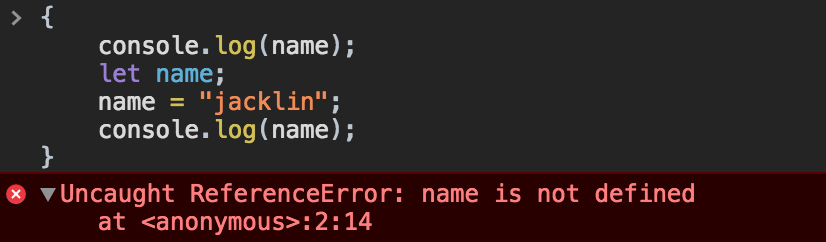

# jsadvanced

The jsadvanced containing some tips, conclusions, best practices for your day to day workflow.
of course, we cannot miss graph and demos to demonstrate!

## Table of Contents

    - [Process control statements loop](#process-control-statements-loop)
    - [Es6 Generator and Iterator](#es6-generator)
    - [Prototype Inherit and class](#prototype-inherit-and-class)
    - [Variables Declaration](#variables-declaration)
    - [Value Types and Reference Types](#value-types-and-reference-types)
    - [Modules](#modules)
    - [Destructuring](#destructuring)
    - [Function](#function)
    - [This](#this)
    - [WebSocket(eg. wsdemo)](#websocketeg-wsdemo)
    - [Watcher(eg. watcher)](#watchereg-watcher)
    - [SourceMap(eg. source-map)](#sourcemapeg-source-map)
    - [Throttle and Debounce](#throttle-and-debounce)
    - [Async and await](#async-and-await)
    - [Symbols](#symbols)
    - [Reflect](#Reflect)
    - [Proxy](#proxy)
    - [Promises](#Promises)
    - [Decorator](#decorator)

## Process control statements loop

how to use loop statement more efficiently.

## Es6 Generator and Iterator

1.Iterator

   对集合中每项进行处理是很常见的操作，从es6开始，js将迭代器和生成器的概念带入核心语言，并提供一种机制自定义for...of的行为；
js中的迭代器是一个对象，它提供了一个next()方法，用来返回序列中的下一项。这个方法返回包含两个属性：done和 value；

```javascript
    function makeIterator(array){
        var nextIndex = 0;
        return {
            next: function(){
                return nextIndex < array.length ?
                    {value: array[nextIndex++], done: false} :
                    {done: true};
            }
        };
    }

    var it = makeIterator(['yo', 'ya']);
    console.log(it.next().value); // 'yo'
    console.log(it.next().value); // 'ya'
    console.log(it.next().done);  // true
```

2.Generator

2.1基本概念
    自定义迭代器需要自己维护内部状态，存在安全风险；generator提供强大的选择，它允许你定义一个包含自有迭代算法的函数（生成器函数）， 同时它可以自动维护自己的状态。

```javascript
function* idMaker() {
  var index = 0;
  while(true)
    yield index++;
}

var gen = idMaker();

console.log(gen.next().value); // 0
```

2.2 可迭代对象

(1) 同步可迭代对象
    在js中定义了@@iterator方法的对象称为可迭代对象，即该对象必须定义属性Symbol.iterator;原生对象中有许多可迭代对象，例如：string,array, set和map; 在js中，有一些语法是构建在可迭代对象上的，它们是：for...of, 扩展运算符， yield*, 解构运算符；The next()方法也接受可用于修改生成器内部状态的值。传递给next()的值将被视为暂停生成器的最后一个yield表达式的结果。

```javascript
    var myIterable = {};
    myIterable[Symbol.iterator] = function* () {
        yield 1;
        yield 2;
        yield 3;
    };

    for (let value of myIterable) {
        console.log(value);
    }
```

(2) 异步可迭代对象
    Iterator接口是一种数据遍历的协议，只要调用遍历器对象的next方法，就会得到一个对象；ES2018 引入了”异步遍历器“（Async Iterator），为异步操
作提供原生的遍历器接口，即value和done这两个属性都是异步产生。异步遍历器的最大的语法特点，就是调用遍历器的next方法，返回的是一个Promise对象。对象的异步遍历器接口，部署在Symbol.asyncIterator属性上面;

(3) 异步
    异步遍历器的设计目的之一，就是 Generator 函数处理同步操作和异步操作时，能够使用同一套接口;

```javascript
    async function* gen() {
        yield 'hello';
    }
    const genObj = gen();
    genObj.next().then(x => console.log(x));
```

## Map + Set + WeakMap + WeakSet

    健值对的集合，很多算法中常见的数据结构；其中Map和Set是可迭代对象，迭代的顺序跟元素插入的顺序相同；

1.Set

1.1 定义和使用

```javascript
    // definition
    new Set([iterable])
    // Properties
    Set.prototype.size
    // method
    Set.prototype.add(value);
    Set.prototype.delete(value);
    Set.prototype.clear();
    // Returns a new Iterator object that contains an array of [value, value] for each element in the Set object
    Set.prototype.entries();
    Set.prototype.forEach(callbackFn[, thisArg]);
    Set.prototype.has(value);
    Set.prototype.keys();
    Set.prototype.values();
    Set.prototype.values();
```

1.2 特性

    值的集合，可迭代对象(与元素插入顺序一致)，一个值只能在Set中出现一次;

1.3 Array和Set的比较

(1) Array和Set可以相互转换：Set可以通过Array.from(Set)和[...Set]转换成数组，数组可以通过Set的构造函数转换成Set。
(2) 判断一个元素是否存在，Set更高效（比array的indexOf等高效）。
(3) Set可以根据值删除一个元素，而Array只能通过index。
(4) Set存储的是唯一值。

2.Map

2.1 定义和使用

```javascript
    // definition
    new Map([iterable])
    // Properties
    Map.size
    // method
    Map.prototype.delete(key);
    Map.prototype.has(key);
    Map.prototype.get(key);
    Map.prototype.delete(key, value);
    Map.prototype.clear();

    mapObj = new Map();
    mapObj.set('dog', 'woof');
    mapObj.set('cat', 'meow');
    mapObj.size //2
    for (var [key, value] of mapObj) {
        console.log(key + ' goes ' + value);
    }
```

2.2 特性

    健值对的集合，可迭代（迭代次序根据元素插入的顺序一致；）

2.3 比较Object和Map

    Object和Map都可以存储键值对，都可以对其进行相应的增删改查等操作；但是Map还是有自己的优势，如下：

(1) Object的键必须是字符串，而Map的键可以是任意值；
(2) Map可以跟容易的获取到存储键值对的数量；
(3) Map对象是可迭代对象，迭代次序是和元素插入顺序是一致的;
(4) Object对象有原型，会污染集合（可以通过map = Object.create(null)）；

3.WeakMap
    WeakMap是键值对的集合，其中键是弱引用的；键必须是对象，值可以是任意值；

3.1 定义和使用

```javascript
    // definition
    new WeakMap([iterable])
    // Properties
    WeakMap.length
    // method
    WeakMap.prototype.delete(key);
    WeakMap.prototype.has(key);
    WeakMap.prototype.get(key);
    WeakMap.prototype.delete(key, value);

    weakObj = new WeakMap();
```

3.2 特性
    键是弱引用的；键必须是对象，值可以是任意值；
    特性决定功能：
（1）键是不可枚举的, 无法获取keys，实例不是可迭代对象(若引用导致);
（2）时间复杂度为O(1), 避免了内存泄漏;

4.WeakSet

## Prototype Inherit and class

1.combination inheritance(compose constructor stealing and prototype chain)

```javascript
    function SuperClass(name){
        this.name = name;
    }
    SuperClass.prototype = {
        constructor: SuperClass,
        sayName: function(){
            console.log(this.name);
        }
    };
    function SubClass(name, age){
        //constructor stealing
        SuperClass.call(this, name);
        this.age = age;
    }
    SubClass.prototype = new SuperClass();
    SubClass.prototype.sayAge = function(){
        console.log(this.age);
    };
    var SubObj = new SubClass("jacklin", 19);
```


2.寄生组合继承模式

```javascript
    function SuperClass(name){
        this.name = name;
    }
    SuperClass.prototype = {
        constructor: SuperClass,
        sayName: function(){
            console.log(this.name);
        }
    };
    function SubClass(name, age){
        //constructor stealing, inherit instance property of SuperClass
        SuperClass.call(this, name);
        this.age = age;
    }
    //inherit prototype property of SuperClass
    SubClass.prototype = Object.assign({}, SuperClass.prototype);
    SubClass.prototype.constructor = SubClass;

    SubClass.prototype.sayAge = function(){
        console.log(this.age);
    };
    var SubObj = new SubClass("jacklin", 19);
    console.log(SubObj);
```


3.es6 class

    a very good document: https://developer.mozilla.org/en-US/docs/Web/JavaScript/Reference/Classes

```javascript

```

## Variables Declaration

* var
* let
* const

var变量声明无论出现在代码的任何位置，都会在任何代码执行之前处理(var hoisting)。使用var语句声明的变量的*作用域*是*当前执行位置的上下文*：
一个函数的内部（声明在函数内）或者全局（声明在函数外）。

> **Best Practice**: 最好在作用域的最开始（函数或者全局代码的开头）声明变量。这样可以使变量的作用域变得清晰。

let允许你声明一个作用域被限制在块级中的变量、语句或者表达式。而var关键字声明的变量只能作用于全局或者整个函数块内。

在程序或者函数的顶层，let并不会像var一样在全局对象上创造一个属性，比如：


let 将会提升这个变量到语句块的顶部。然而，在这个语句块中，在变量声明之前引用这个变量会导致一个 ReferenceError的结果,
因为let变量 在"暂存死区" (从块的开始到声明这段).



const声明并初始化一个只读的常量。常量拥有块作用域。常量的值不能通过再赋值改变，也不能再次声明。
这不意味着常量指向的值不可变，而是变量标识符的值只能赋值一次。

```javascript
    // 常量可以定义成对象
    const myObj = {"key": "value"};
    // 重写对象一样会失败
    myObj = {"OTHER_KEY": "value"};
    // 常量对象的属性是可以重写的
    myObj.key = "otherValue";
```


## Value Types and Reference Types

 引用类型使用的时候需要特别注意，如果一个全局引用类型在多个功能函数或者模块中使用, 特别需要注意当给全局引用类型复制给新参的时候，在功能函数或者模块内部修改形参（写操作）。

* 值类型

 ```javascript
      var a = 1;
      var b = a;
      console.log("b====>", b)// 1
 ```

* 引用类型

1. console打印引用类型

 ```javascript
      var a = {name: "jack"};
      console.log("a========>",a);
      // {name: "mike"}
      var b = a;
      b.name = "mike";
      console.log("b====>", b);
      // {name: "mike"}
 ```

2.引用类型作为实参传给功能函数（模块）,注意引用类型的写操作；

 ```javascript
    var person = {name: "jack", age: 19};
    function updateName(person,name) {
        person.name = name;
    }
    function updateAge(person,age) {
        person.age = age;
    }

    updateName(person, "mike");
 ```

2.使用JSON.parse(JSON.stringify(a))来实现引用类型的深度复制


## Modules

<a name="modules--use-them"></a><a name="10.1"></a>
  - [10.1](#modules--use-them) Always use modules (`import`/`export`) over a non-standard module system. You can always transpile to your preferred module system.

    > Why? Modules are the future, let's start using the future now.

    ```javascript
    // bad
    const AirbnbStyleGuide = require('./AirbnbStyleGuide');
    module.exports = AirbnbStyleGuide.es6;

    // ok
    import AirbnbStyleGuide from './AirbnbStyleGuide';
    export default AirbnbStyleGuide.es6;

    // best
    import { es6 } from './AirbnbStyleGuide';
    export default es6;
    ```

  <a name="modules--no-wildcard"></a><a name="10.2"></a>
  - [10.2](#modules--no-wildcard) Do not use wildcard imports.

    > Why? This makes sure you have a single default export.

    ```javascript
    // bad
    import * as AirbnbStyleGuide from './AirbnbStyleGuide';

    // good
    import AirbnbStyleGuide from './AirbnbStyleGuide';
    ```

  <a name="modules--no-export-from-import"></a><a name="10.3"></a>
  - [10.3](#modules--no-export-from-import) And do not export directly from an import.

    > Why? Although the one-liner is concise, having one clear way to import and one clear way to export makes things consistent.

    ```javascript
    // bad
    // filename es6.js
    export { es6 as default } from './AirbnbStyleGuide';

    // good
    // filename es6.js
    import { es6 } from './AirbnbStyleGuide';
    export default es6;
    ```

  <a name="modules--no-duplicate-imports"></a>
  - [10.4](#modules--no-duplicate-imports) Only import from a path in one place.
 eslint: [`no-duplicate-imports`](http://eslint.org/docs/rules/no-duplicate-imports)
    > Why? Having multiple lines that import from the same path can make code harder to maintain.

    ```javascript
    // bad
    import foo from 'foo';
    // … some other imports … //
    import { named1, named2 } from 'foo';

    // good
    import foo, { named1, named2 } from 'foo';

    // good
    import foo, {
      named1,
      named2,
    } from 'foo';
    ```

  <a name="modules--no-mutable-exports"></a>
  - [10.5](#modules--no-mutable-exports) Do not export mutable bindings.
 eslint: [`import/no-mutable-exports`](https://github.com/benmosher/eslint-plugin-import/blob/master/docs/rules/no-mutable-exports.md)
    > Why? Mutation should be avoided in general, but in particular when exporting mutable bindings. While this technique may be needed for some special cases, in general, only constant references should be exported.

    ```javascript
    // bad
    let foo = 3;
    export { foo };

    // good
    const foo = 3;
    export { foo };
    ```

  <a name="modules--prefer-default-export"></a>
  - [10.6](#modules--prefer-default-export) In modules with a single export, prefer default export over named export.
 eslint: [`import/prefer-default-export`](https://github.com/benmosher/eslint-plugin-import/blob/master/docs/rules/prefer-default-export.md)

    ```javascript
    // bad
    export function foo() {}

    // good
    export default function foo() {}
    ```

  <a name="modules--imports-first"></a>
  - [10.7](#modules--imports-first) Put all `import`s above non-import statements.
 eslint: [`import/first`](https://github.com/benmosher/eslint-plugin-import/blob/master/docs/rules/first.md)
    > Why? Since `import`s are hoisted, keeping them all at the top prevents surprising behavior.

    ```javascript
    // bad
    import foo from 'foo';
    foo.init();

    import bar from 'bar';

    // good
    import foo from 'foo';
    import bar from 'bar';

    foo.init();
    ```

  <a name="modules--multiline-imports-over-newlines"></a>
  - [10.8](#modules--multiline-imports-over-newlines) Multiline imports should be indented just like multiline array and object literals.

    > Why? The curly braces follow the same indentation rules as every other curly brace block in the style guide, as do the trailing commas.

    ```javascript
    // bad
    import {longNameA, longNameB, longNameC, longNameD, longNameE} from 'path';

    // good
    import {
      longNameA,
      longNameB,
      longNameC,
      longNameD,
      longNameE,
    } from 'path';
    ```

  <a name="modules--no-webpack-loader-syntax"></a>
  - [10.9](#modules--no-webpack-loader-syntax) Disallow Webpack loader syntax in module import statements.
 eslint: [`import/no-webpack-loader-syntax`](https://github.com/benmosher/eslint-plugin-import/blob/master/docs/rules/no-webpack-loader-syntax.md)
    > Why? Since using Webpack syntax in the imports couples the code to a module bundler. Prefer using the loader syntax in `webpack.config.js`.

    ```javascript
    // bad
    import fooSass from 'css!sass!foo.scss';
    import barCss from 'style!css!bar.css';

    // good
    import fooSass from 'foo.scss';
    import barCss from 'bar.css';
    ```

**[⬆ back to top](#table-of-contents)**


## Destructuring
* object destructuring
> **Best Practice**: Use object destructuring for multiple return values, not array destructuring;
    Destructuring saves you from creating temporary references for those properties.

```javascript
    var user = {
            firstName: "lin",
            lastName: "chengyong"
    }
    // bad
    function getFullName(user) {
      const firstName = user.firstName;
      const lastName = user.lastName;
      ...
      return [firstName, lastName];
    }
    //the caller needs to know the order of return data
    var [firstName, lastName] = getFullName(user);

    // good
    function getFullName(user) {
      const { firstName, lastName } = user;
      ...
      return {firstName, lastName};
    }

    // best
    function getFullName({ firstName, lastName }) {
      ...
      return {firstName, lastName};
    }
    // the caller selects only the data they need
    var {firstName, lastName} = getFullName(user);

```
* array destructuring

```javascript
    const arr = [1, 2, 3, 4];

    // bad
    const first = arr[0];
    const second = arr[1];

    // good
    const [first, second] = arr;
```
* the scene of destructuring

1.函数参数的定义, 对于设计良好的api,通常为函数设计一个对象作为函数的参数，这样可以避免开发者需要记住多个参数的使用顺序。
    同时，使用解构可以避免为这些参数属性创建临时的引用。
```javascript
    function Caller({url, name, ...}){
        // we can use url, name and all the property of parameter object directly.
    }
```
2.给需要解构的的对象属性赋予默认值。
```javascript
    function Caller({
        async = true,
        cache = true,
        beforeSend = noop,
        global = true,
        // more config
        ...
    }){
        // we can use url, name and all the property of parameter object directly.
    };
```
3.使用解构导入部分CommonJS模块
    当我们导入CommonJS模块的时候，很可能在模块中存在很多用不上的方法，通过解构可以很方便的定义模块的一部分方法拆分使用
    这样可以避免命名空间的污染。
```javascript
    const {PropertyA, PropertyB} = require("CommonJs module");
```

## Function
在JavaScript中，函数是第一等对象，不仅因为它既可以像普通对象一样拥有属性和方法，而且重要的是它可以被调用。简单来说它们是Function对象。
函数不同于过程。函数总是会返回一个值，但是一个过程有可能返回一个值，也有可能不返回,如果一个函数中没有使用return语句，则它默认返回undefined。
>**Note**:在函数执行时，this 关键字并不会指向正在运行的函数本身，而是指向调用该函数的对象。
* Use named function expressions instead of function declarations.
Function declarations are hoisted, which means that it’s easy - too easy - to reference the function before it is defined in the file.
This harms readability and maintainability.anonymous functions can make it harder to locate the problem in an Error's call stack.
```javascript
    // bad
    function foo() {
      // ...
    }

    // bad
    const foo = function () {
      // ...
    };

    // good
    const foo = function bar() {
      // ...
    };
```
* Always put default parameters last.
```javascript
    // bad
    function handler(opts = {}, name) {
      // ...
    }

    // good
    function handler(name, opts = {}) {
      // ...
    }
```
* Never mutate parameters.
```javascript
    // bad
    function f1(obj) {
      obj.key = 1;
    }

    // good
    function f2(obj) {
      const key = Object.prototype.hasOwnProperty.call(obj, 'key') ? obj.key : 1;
    }
```
* Arrow Function


* getter
 get 语法将一个对象属性绑定到查询该属性时将被调用的一个函数上。

* setter

## This

函数的调用方式决定了this的值。this不能在执行期间被赋值，在每次函数被调用时this的值也可能会不同。
ES5引入了bind方法来设置函数的this值，而不用考虑函数如何被调用的。

* 在全局作上下文中运行（任何函数外部),this指代全局对象。

```javascript
    function sum(num1, num2){
        return num1+num2;
    }
    sum(2,3);//5
    this.sum(2,1);//3
    window.sum(2,1);//3
```

* 函数上下文

>**Note**:在函数内部，this的值取决于**函数是如何调用的**。

在严格模式下执行，并且this的值不会在函数执行时被设置，此时的this的值会默认设置为全局对象。

```javascript
    function f1(){
      return this;
    }
    f1() === window; // true
```

在严格模式下，如果this未被执行的上下文环境定义，那么它将会默认为undefined。

```javascript
    function f2(){
      "use strict"; // 这里是严格模式
      return this;
    }
    f2() === undefined; // true
```

1. 以对象方法调用.

>**Note**: 当以对象里的方法的方式调用函数时，它们的 this 是调用该函数的对象.

```javascript
    var obj = {
        prop: "jack",
        fa: function(){
            console.log(this.prop)
        },
        g: {
            prop: "kathy",
            fb: function(){
                console.log(this.prop)
            }
        }
    }
    obj.fa();//jack
    obj.g.fb();//kathy


    var obj = {
        prop: "jack",
        fa: function(){
            console.log(this.prop)
        },
        g: {
            fb: function(){
                console.log(this.prop)
            }
        }
    }
    obj.fa();//jack
    obj.g.fb();//kathy

    var obj = {
        prop: "jack",
        fa: function(){
            console.log(this.prop)
        },
        g: {
            fb: function(){
                console.log(this)
            }
        }
    }
    obj.fa();//jack
    obj.g.fb();//undefined
```

2.原型链中的 this
>**Note**: 函数作为那个对象的方法，this就是指代是哪个对象（是父对象还是子对象）。

```javascript
    var o = {
      f : function(){
        return this.a + this.b;
      },
      a: 2,
      b: 7
    };
    var p = Object.create(o);
    p.a = 1;
    p.b = 4;
    //因为f是作为p的方法调用的，所以它的this指向了p
    console.log(p.f()); // 5
    //因为f是作为o的方法调用的，所以它的this指向了o
    console.log(o.f()); // 9
```

3.call 和 apply
>**Note**: 所有函数都从Function对象的原型中继承的call()方法和apply()方法.

```javascript
    function add(c, d){
      return this.a + this.b + c + d;
    }

    var o = {a:1, b:3};

    // The first parameter is the object to use as 'this', subsequent parameters are passed as
    // arguments in the function call
    add.call(o, 5, 7); // 1 + 3 + 5 + 7 = 16

    // The first parameter is the object to use as 'this', the second is an array whose
    // members are used as the arguments in the function call
    add.apply(o, [10, 20]); // 1 + 3 + 10 + 20 = 34
```

4.bind

ECMAScript 5 引入了 Function.prototype.bind。调用f.bind(someObject)，函数中this将永久地被绑定到了bind的第一个参数，无论这个函数是如何被调用的。

5.DOM事件处理函数中的 this

>**Note**: 当函数被用作事件处理函数时，它的this指向触发事件的元素（一些浏览器在使用非addEventListener的函数动态添加监听函数时不遵守这个约定）。

```javascript
    <div class="header">
            i am a worker.
    </div>
    <script>
        var ele = document.getElementsByClassName('header');
        var clickHandler = function (e) {
            console.log(this === e.currentTarget); // 总是 true
            // 当 currentTarget 和 target 是同一个对象是为 true
            console.log(this === e.target);
            this.style.backgroundColor = '#A5D9F3';
        };
        ele[0].addEventListener("click",clickHandler, false);
    </script>
```

1. 内联事件处理函数中的 this

当代码被内联处理函数调用时，它的this指向监听器所在的DOM元素：

```javascript
    //button
    <button onclick="alert(this.tagName.toLowerCase());">
      Show this
    </button>
```

>**Note**: 只有外层代码中的this是这样设置的,函数体内部的this,根据具体情况而定。

```javascript
    //没有设置内部函数的 this，所以它指向 global/window 对象
    <button onclick="alert((function(){return this})());">
      Show inner this
    </button>
```

## WebSocket

   好的websocket解决方案：ws, socket.io

## Watcher(eg. watcher)

    详见demo-watcher,基于chokidar来实现的；

## SourceMap(eg. source-map)

    shttps://github.com/mozilla/source-map

## Throttle and Debounce

    函数去抖以及函数节流，函数节流和消抖的本质都是控制函数（实际场景中通常是事件的回调函数）的执行次数，不同点在于函数去抖是控制函数在一次操作中只执行一次(且为最后一次)；
而定义这一次操作通常是通过单位时间来定义（eg，定时器的设定时间内的行为称为一次操作）；

```javascript
    //函数去抖
    function debounce(func, wait) {
        let timer = null;
        return function () {
            let context = this; //函数执行上下文；
            let args = arguments; //获取函数的参数；

            if(timer){
                clearTimeout(timer);
            }
            timer = setTimeout(function () {
                func.apply(context, args);
            }, wait)
        }
    }
```

    函数节流是指降低函数的执行频率，通常有两种实现方式，其一用时间戳来判断是否已到回调该执行时间，记录上次执行的时间戳，然后每次触发scroll事件执行回调，
    回调中判断当前时间戳距离上次执行时间戳的间隔是否已经到达 1000ms，如果是，则执行，并更新上次执行的时间戳，如此循环；
    第二种方法是使用定时器，比如当 scroll 事件刚触发时，打印一个 hello world，然后设置个 1000ms 的定时器，此后每次触发 scroll 事件触发回调，
    如果已经存在定时器，则回调不执行方法，直到定时器触发，handler 被清除，然后重新设置定时器。

```javascript
    //函数节流
_.throttle = function(func, wait, options) {
  var context, args, result;
  var timeout = null;
  var previous = 0;
  if (!options)
    options = {};

  var later = function() {
    previous = options.leading === false ? 0 : _.now();
    timeout = null;
    result = func.apply(context, args);
    if (!timeout)
      context = args = null;
  };
  return function() {
    var now = _.now();
    if (!previous && options.leading === false)
      previous = now;

    var remaining = wait - (now - previous);
    context = this;
    args = arguments;
    if (remaining <= 0 || remaining > wait) {
      if (timeout) {
        clearTimeout(timeout);
        timeout = null;
      }

      previous = now;
      result = func.apply(context, args);

      if (!timeout)
        context = args = null;
    } else if (!timeout && options.trailing !== false) { // 最后一次需要触发的情况
      timeout = setTimeout(later, remaining);
    }
    return result;
  };
};
```

## Async and await

    ES2017标准引入了async函数，使得异步操作变得更加方便。本质上它就是Generator函数的语法糖。

1. async与generator对比

(1) 内置执行器。
Generator 函数的执行必须靠执行器，所以才有了co模块，而async函数自带执行器, 与普通函数一模一样;
(2) 更好的语义。
async和await，比起星号和yield，语义更清楚了。async表示函数里有异步操作，await表示紧跟在后面的表达式需要等待结果。
(3) 更广的适用性。
co模块约定，yield命令后面只能是 Thunk函数或Promise 对象，而async函数的await命令后面，可以是 Promise对象和原始类型的值;
(3)返回值是 Promise。
async函数的返回值是 Promise 对象，这比 Generator 函数的返回值是 Iterator 对象方便多了;

2.async and await的异常处理;

(1) async函数内部return语句返回的值，会成为then方法回调函数的参数。

```javascript
async function f() {
  throw new Error('出错了');
}

f().then(
  v => console.log(v)
).catch((error) => {
    console.error("process error:", error);
})
```

(2) Promise 对象的状态变化

 async函数返回的 Promise 对象，必须等到内部所有await命令后面的 Promise 对象执行完，才会发生状态改变，除非遇到return语句或者抛出错误。也就是说，只有async函数内部的异步操作执行完，才会执行then方法指定的回调函数。

(3) await命令

    一般情况下来说，await命令后面是一个Promise对象，返回该对象的结果。如果不是Promise对象，就直接返回对应的值。
如果await后面的异步操作出错，那么等同于async函数返回的 Promise 对象被reject。

```javascript
    async function f() {
    // 等同于
    // return 123;
    return await 123;
    }

    f().then(v => console.log(v))
```

3.async and await使用注意事项;

(1) await命令后面的Promise对象，运行结果可能是rejected，所以最好把await命令放在try...catch代码块中。

```javascript
    async function f() {
    // 等同于
    // return 123;
    return await 123;
    }

    f().then(v => console.log(v))
```

(2) 多个await命令后面的异步操作，如果不存在继发关系，最好让它们同时触发。

```javascript
    // bad
    let foo = await getFoo();
    let bar = await getBar();
    // good
    let fooPromise = getFoo();
    let barPromise = getBar();
    let foo = await fooPromise;
    let bar = await barPromise;
```

(3) await命令只能用在async函数之中，如果用在普通函数，就会报错。

(4) async 函数可以保留运行堆栈。


## Symbols

2.1 定义
    一种新的原始数据类型（其它的原始数据类型：string, boolean, number, objec, undefined, null），每一个Symbols都可以代表一个独一无二的值，
可以用于解决对象属性名冲突的问题；

```javascript
    //接受字符串作为Symbol的描述符；
    let s1 = Symbol('foo');
    // 第一种写法
    let a = {};
    a[s1] = 'Hello!';

    // 第二种写法
    let a = {
        [s1]: 'Hello!'
    };

    // 第三种写法
    let a = {};
    Object.defineProperty(a, s1, { value: 'Hello!' });
```

2.2特性

(1) Symbol 值不能与其他类型的值进行运算；
(2) 在对象的内部，使用 Symbol 值定义属性时，Symbol 值必须放在方括号之中;
(3) 消除魔术字符串;
(4) Symbol 作为属性名，该属性不会出现在for...in、for...of循环中，也不会被Object.keys、Object.getOwnPropertyNames、JSON.stringify返回。但是，它也不是私有属性，有一个Object.getOwnPropertySymbols方法，可以获取指定对象的所有 Symbol 属性名。

## Proxy

    Proxy主要用于代理对象的行为，通过对被代理对象的代理，可以用于拦截对象的行为，对象虚拟化以及日志分析等；

```javascript
    //对于每一个被代理的操作，需要提供一个对应的处理函数，该函数将拦截对应的操作;
    var proxy = new Proxy(target, handler);

    // Proxying a normal object
    var target = {};
    var handler = {
        get: function (receiver, name) {
            return `Hello, ${name}!`;
        }
    };

    var p = new Proxy(target, handler);
    p.world === "Hello, world!";

    // Proxying a function object
    var target = function () { return "I am the target"; };
    var handler = {
    apply: function (receiver, ...args) {
        return "I am the proxy";
    }
    };

    var p = new Proxy(target, handler);
    p() === "I am the proxy";

    //拦截对象属性的读取，比如proxy.foo和proxy['foo']。
    get(target, propKey, receiver);
    //拦截对象属性的设置，比如proxy.foo = v或proxy['foo'] = v，返回一个布尔值。
    set(target, propKey, value, receiver);
    //拦截propKey in proxy的操作，返回一个布尔值。
    has(target, propKey);
    //拦截delete proxy[propKey]的操作，返回一个布尔值。
    deleteProperty(target, propKey);
    //拦截Object.getOwnPropertyNames(proxy)、Object.getOwnPropertySymbols(proxy)、Object.keys(proxy)、for...in循环，返回一个数组。//该方法返回目标对象所有自身的属性的属性名，而Object.keys()的返回结果仅包括目标对象自身的可遍历属性。
    ownKeys(target);
    //拦截Object.getOwnPropertyDescriptor(proxy, propKey)，返回属性的描述对象。
    getOwnPropertyDescriptor(target, propKey);
    //拦截Object.defineProperty(proxy, propKey, propDesc）、Object.defineProperties(proxy, propDescs)，返回一个布尔值。
    defineProperty(target, propKey, propDesc)：
    //拦截Object.preventExtensions(proxy)，返回一个布尔值。
    preventExtensions(target);
    //拦截Object.getPrototypeOf(proxy)，返回一个对象。
    getPrototypeOf(target);
    //拦截Object.isExtensible(proxy)，返回一个布尔值。
    isExtensible(target);
    //拦截Object.setPrototypeOf(proxy, proto)，返回一个布尔值。如果目标对象是函数，那么还有两种额外操作可以拦截。
    setPrototypeOf(target, proto);
    //拦截 Proxy 实例作为函数调用的操作，比如proxy(...args)、proxy.call(object, ...args)、proxy.apply(...)。
    apply(target, object, args);
    //：拦截 Proxy 实例作为构造函数调用的操作，比如new proxy(...args)。
    construct(target, args)
```

## Promises

1.将对象转换为Promise。

```javascript
    Promise.resolve('foo')
    // 等价于
    new Promise(resolve => resolve('foo'))
```

## Decorator
